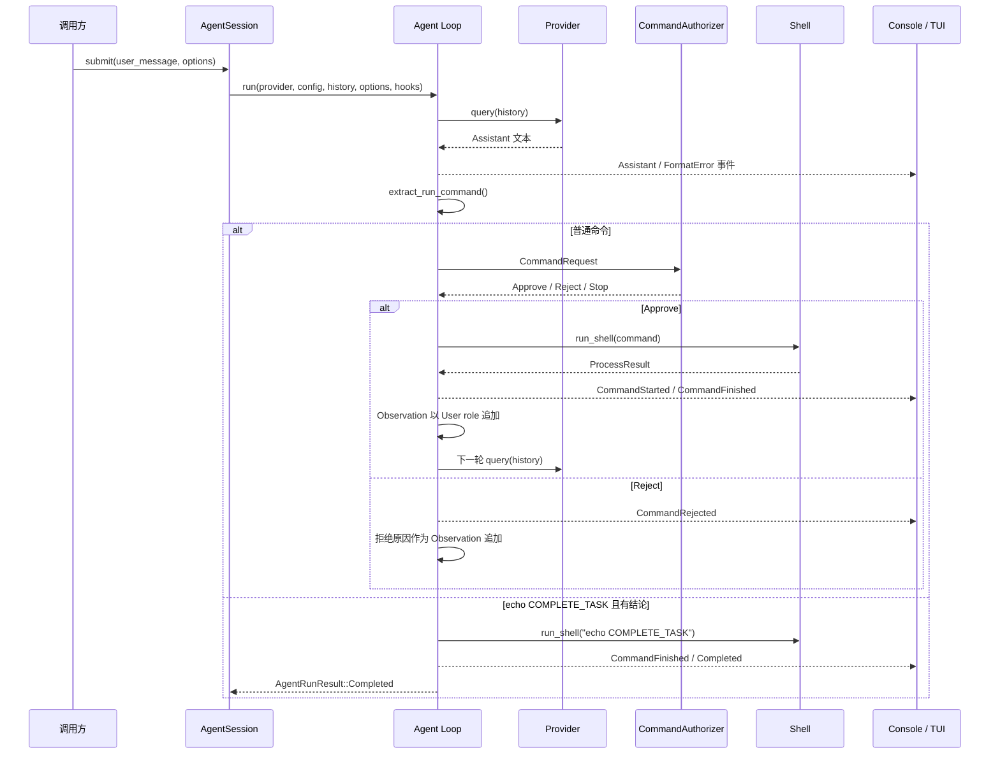

# Agent Loop 与命令执行

[返回开发者文档入口](../README.md) · [总体架构](architecture.md) ·
[模块与源码导读](modules.md)

## 循环职责

Agent Loop 位于 [`include/agent/agent_loop.hpp`](../include/agent/agent_loop.hpp)。
它负责在已有消息历史上重复调用模型、解析命令、请求授权、执行 Shell、
追加 Observation，并在完成、停止、步数上限或空响应时返回。

它不负责：

- 创建或选择 Session；
- 决定 Console/TUI 的展示形式；
- 实现具体 Provider；
- 决定人工审核界面；
- 持久化存储细节。

这些行为分别通过调用方、Provider、回调和 `HistoryHooks` 注入。

## 一轮执行流程



## `RUN:` 协议

模型通过单独一行请求命令：

```text
RUN: <command>
```

解析器逐行检查文本，允许 `RUN:` 前存在空格或 Tab。它返回第一个命令内容
非空的有效 `RUN:` 行，并去掉前导空格和右侧换行。普通说明文字不会成为
命令；同一回复中的后续 `RUN:` 行不会执行。

如果模型回复非空但没有有效 `RUN:`，循环会：

1. 把 Assistant 回复写入历史；
2. 发出 `Assistant` 和 `FormatError` 事件；
3. 以 User role 追加 Host hint，重申运行或完成协议；
4. 增加 step 并再次请求模型。

纯文本回复不会被当作完成。

## 完成协议

唯一的完成信号是：

```text
RUN: echo COMPLETE_TASK
```

同一条模型回复中必须还有去除所有 `RUN:` 行后仍非空的结论。例如：

```text
Conclusion:
已完成配置检查。
RUN: echo COMPLETE_TASK
```

缺少结论时，循环拒绝完成，追加专用 Host hint 并继续。有效完成信号不走
普通 `CommandAuthorizer`，但当前实现仍会调用 `run_shell()` 执行
`echo COMPLETE_TASK`，产生 `CommandStarted` 和 `CommandFinished` 事件；
随后若没有停止请求，再发出 `Completed`。

## 历史记录

Agent Loop 使用 `model::MSG`，即按顺序保存的 `Message` 列表：

- System Prompt 使用 `Role::System`；
- 用户任务、Host hint 和 Observation 使用 `Role::User`；
- 模型回复使用 `Role::Assistant`。

`HistoryEntryKind` 进一步区分 `System`、`UserPrompt`、`Assistant`、
`Observation` 和 `HostHint`，供 Session 持久化使用。`append_history()` 先
修改内存，再调用 hook；hook 抛出异常时会回滚本次内存追加并继续向上抛。

普通命令结束后写回模型的内容形如：

```text
Observation:
$ <command>
<stdout/stderr>
<可选状态标记>
```

命令被拒绝时也会写入 Observation，使模型能够调整下一步，而不是直接
终止整个任务。

## step 语义与终态

`step` 表示已经消耗的继续轮次，而不是单纯的模型请求次数。产生
Observation、格式提示或拒绝提示后会递增；有效完成在当前 step 返回。

`AgentRunStatus` 有四种终态：

| 状态 | 触发条件 |
| --- | --- |
| `Completed` | 有非空结论的完成命令执行完毕，且没有随后观察到停止 |
| `Stopped` | 在检查点观察到停止，或授权器返回 `Stop` |
| `StepLimitReached` | `step_limit > 0` 且当前 step 已达到上限 |
| `EmptyResponse` | Provider 返回空内容 |

`step_limit: 0` 表示不限制。限制检查发生在每轮模型请求之前。

## 停止检查点

循环在以下位置检查 `StopToken`：

1. 每轮 Provider 请求前；
2. Provider 返回后；
3. 请求普通命令授权前；
4. 普通命令执行后；
5. 完成命令执行后、发出 `Completed` 前。

停止是协作式的。当前 HTTP POST 和 `popen()` 调用为同步阻塞操作，停止
请求不会强制取消它们；调用返回后，`Stopped` 优先于继续请求模型或提交
完成状态。

## 命令授权

普通命令先由 `evaluate_command_policy()` 分类，再由
`authorize_command()` 结合前端 Reviewer 生成最终决定。

### 策略分类顺序

| 顺序 | 条件 | 结果 | `rule_id` |
| --- | --- | --- | --- |
| 1 | 无法提取首个程序 token | `RequireReview` | `empty-command` |
| 2 | 程序 basename 为 `reboot`、`shutdown`、`rm` 或 `rmdir` | `Deny` | `denied-program` |
| 3 | 含 `;`、`|`、`<`、`>`、`&`、反引号、换行、回车或 `$(` | `RequireReview` | `complex-shell-syntax` |
| 4 | 程序 basename 为 `sudo`、`sh`、`bash` 或 `zsh` | `RequireReview` | `shell-wrapper` |
| 5 | 其他输入 | `Allow` | `default-allow` |

程序通过第一个空白分隔 token 的文件名判断，因此 `/bin/rm file` 也会被
拒绝。拒绝规则先于复杂语法检查，例如 `rm file && echo done` 仍命中
`denied-program`。

策略只做保守的文本分类，不展开变量、不解析引号、不理解 alias/function，
也不是完整 POSIX Shell 解析器。当前规则硬编码在 C++ 中，不支持从 YAML
配置模式匹配规则。

### 策略与 Reviewer 的组合

- `Deny`：立即生成 `Reject`，Reviewer 不能覆盖。
- `RequireReview`：存在 Reviewer 时询问；不存在时以
  `review-unavailable` 拒绝。
- `Allow`：Auto 模式直接批准；`review_all` 为真时仍交给 Reviewer。

Console 设置 `review_all=false`，只审核策略要求人工确认的命令。TUI 的
Auto 模式同样只审核 `RequireReview`；Review 模式令所有非拒绝命令都经过
人工确认。用户拒绝和等待期间的停止也会转成 `CommandDecision`。

## Shell 执行与输出

`run_shell()` 将 `2>&1` 追加到命令后，通过 `popen()` 读取合并后的
stdout/stderr，并用 `pclose()` 获取退出状态。该函数不因普通命令失败而
抛异常，而是返回 `ProcessResult`：

- 正常退出：`termination=Exited`，保存 exit code；
- 信号终止：`termination=Signaled`，保存 signal number；
- `popen()`/`pclose()` 失败：`termination=ExecutionError` 并保存错误文本；
- 无法分类：`termination=Unknown`。

输出最多保留 16 KiB。超过后设置 `truncated=true`，但仍继续读取并丢弃
剩余数据，防止子进程阻塞在管道写入。`format_process_result()` 会附加
`[exit=N]`、`[signal=N]`、`[status=unknown]` 或 `...[truncated]` 等状态。

## 事件顺序

典型普通命令事件顺序为：

```text
Assistant
CommandStarted
CommandFinished
```

拒绝命令为：

```text
Assistant
CommandRejected
```

有效完成为了避免重复展示结论，不发普通 `Assistant` 事件，而是：

```text
CommandStarted
CommandFinished
Completed
```

界面消费者应以 `AgentRunResult` 判断 Worker 是否真正结束，不应仅凭终态
事件立即允许下一次提交。
