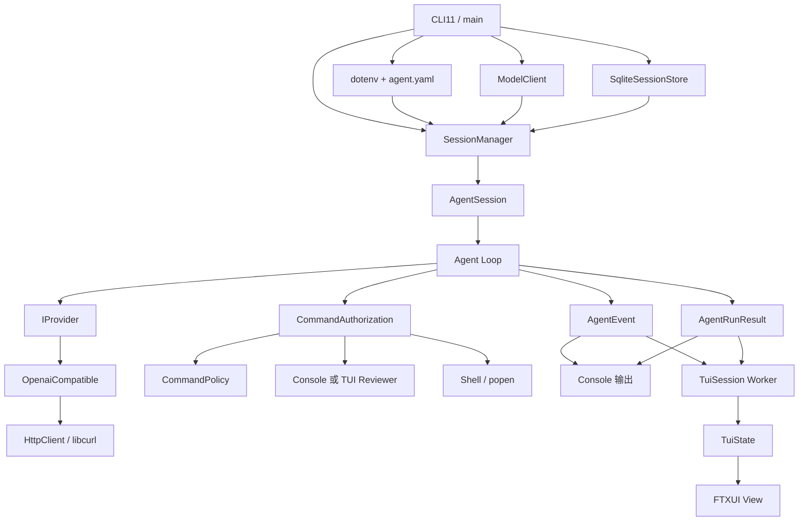
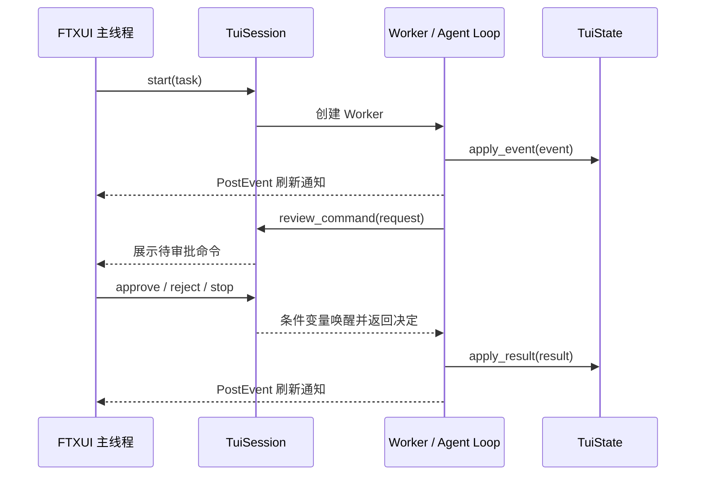

# 总体架构

[返回开发者文档入口](../README.md) · [Agent Loop](agent-loop.md) ·
[模块与源码导读](modules.md)

## 设计概览

My_Agent 将模型访问、Agent 循环、Session、命令执行和界面展示分开。
Console 与 TUI 都从 `SessionManager` 提交任务，并通过 `AgentRunOptions`
注入事件消费者、停止令牌和命令授权器。核心执行路径不依赖具体界面。



## 启动与对象所有权

[`main()`](../src/main.cpp) 完成进程级装配：

1. `Cli` 解析模式、模型覆盖和 Session 选项。
2. 加载 `.env` 与 `config/agent.yaml`。
3. 使用 endpoint、API key 和模型名构造 `ModelClient`。
4. 计算数据库路径并构造 `SqliteSessionStore`。
5. 构造 `SessionManager`，将当前规范化工作目录作为 workspace。
6. 根据 `-c` 恢复最新 Session，否则创建新 Session。
7. 根据 `-t` 是否出现进入 Console 或 TUI。

`SessionManager` 持有当前 `AgentSession` 的唯一所有权，但只引用进程级的
Provider 和 Session Store。切换会话时，它替换当前内存 Session；持久化
记录仍由 Store 管理。

## 核心调用链

```text
main
  -> SessionManager::submit
  -> AgentSession::submit
  -> agent::run
       -> IProvider::query
       -> extract_run_command
       -> CommandAuthorizer
       -> run_shell
       -> append_history
  -> AgentRunResult
```

`AgentSession` 为循环提供可复用的 history。每次提交先追加 User Prompt，
随后 Agent Loop 追加 Assistant、Observation 和 Host hint。若 Session 绑定
Store，这些追加通过 `HistoryHooks` 同步写入数据库。

## 模型边界

`IProvider` 是运行时多态接口，`Provider` concept 是模板循环使用的编译期
契约，二者都要求 `query(MSG)` 返回 `ModelResponse`。`ModelClient` 当前
内部固定持有 `OpenaiCompatible`，使上层不依赖 HTTP 和 JSON 细节。

`OpenaiCompatible` 负责：

- 把历史转换为 OpenAI Compatible `messages`；
- 使用 `HttpClient` 发送 JSON POST；
- 检查 HTTP 状态码；
- 从 `choices[0].message.content` 读取回复文本。

真实网络调用没有被单元测试替代；请求 JSON 的格式逻辑和上层 Provider
契约可独立测试。

## 命令执行边界

Agent Loop 只识别模型文本中的 `RUN:` 协议，不直接解释自然语言。普通命令
先交给 `CommandAuthorizer`：

```text
CommandRequest
  -> CommandPolicy: Allow / RequireReview / Deny
  -> 可选 Reviewer
  -> CommandDecision: Approve / Reject / Stop
  -> run_shell（仅 Approve）
```

策略的 `Deny` 不可被 Reviewer 覆盖；`RequireReview` 在没有 Reviewer 时
安全拒绝。TUI 还可在 Review 模式下让策略已经允许的命令也经过人工确认。
具体规则见 [Agent Loop：命令授权](agent-loop.md#命令授权)。

Shell 使用 `popen()`，由系统 Shell 执行命令并合并 stdout/stderr。核心层不
提供容器或进程级沙箱，安全边界来自策略、审核和运行程序的操作系统权限。

## 事件与最终结果

循环用两类对象向外传递状态：

- `AgentEvent`：运行中的瞬时事件，如 Assistant 回复、命令开始/结束、
  命令拒绝、格式错误和终态通知；
- `AgentRunResult`：循环真正返回后的最终状态、最后模型响应和 step。

事件不代表 Worker 已经退出。特别是 TUI 收到 `Completed` 事件后仍保持
busy，直到 `AgentRunResult` 返回并由 `TuiState::apply_result()` 提交终态。
这避免旧 Worker 尚未结束时启动新任务。

## Console 与 TUI

### Console

Console 在主线程同步调用 `SessionManager::submit()`。事件回调直接写入
stdout/stderr；需要人工审核时，Reviewer 从终端读取用户选择。标准输入
不是 TTY 时，无法审核的命令会被拒绝。

### TUI

TUI 主线程运行 FTXUI 事件循环，`TuiSession` 的 Worker 线程同步执行
`SessionManager::submit()`。Worker 产生的事件在互斥锁保护下更新
`TuiState`，再通过 FTXUI 的线程安全事件通知主线程刷新。

命令审核使用条件变量：Worker 发布待审核命令并等待，TUI 主线程提交
批准、拒绝或停止决定。退出前 `TuiSession` 请求停止并 join Worker。



停止使用共享原子标志实现的 `StopSource` / `StopToken`。它是协作式的：
循环只在预设检查点观察停止请求，不会强制取消正在阻塞的 HTTP 请求或
Shell 子进程。

## CMake 目标与依赖方向

| 目标 | 主要内容 | 关键依赖 |
| --- | --- | --- |
| `swe_agent_core` | 配置、HTTP、模型、Agent、Session、Shell、命令授权 | libcurl、yaml-cpp、SQLite3、nlohmann/json |
| `swe_agent_tui_support` | TUI 状态、Worker、日志块、视口、输入历史、动画 | Threads |
| `swe-agent` | CLI、main、FTXUI 事件循环和绘制 | 两个内部库、CLI11、FTXUI、Threads |
| `swe_agent_tests` | 聚合单元测试 | Catch2 及生产目标 |

FTXUI 类型只出现在最终应用和绘制层，不进入 `swe_agent_core`。TUI 支持库
的大部分状态逻辑也不依赖 FTXUI，因此可以用普通单元测试验证。

## 当前架构限制

- `ModelClient` 尚未提供运行时选择多种 Provider 的注册机制。
- HTTP 和 Shell 调用均为同步阻塞；停止只能在调用返回后生效。
- 命令策略不是完整 Shell 解析器，不能推断所有间接执行行为。
- TUI 日志按事件更新，但 Shell 输出只在命令结束后整体返回。
- 配置文件位置与当前工作目录绑定，安装后不会自动发现全局配置。
