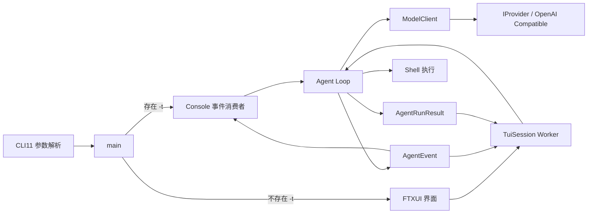

# FTXUI TUI 集成与 Agent Loop 事件化更改说明

[返回开发者文档入口](../README.md) · [当前 Session 与 TUI 指南](session-and-tui.md)

更新日期：2026-07-18

## 1. 更改概述

本次更改为 `agent` 引入基于 FTXUI 的全屏交互界面，并将 Agent Loop 从“直接向标准输出打印”调整为“产生结构化事件和运行结果”。Console 与 TUI 现在共用同一套核心执行逻辑，只负责以不同方式展示事件。

主要目标：

- 默认提供可连续提交任务的 TUI。
- 保留适合脚本和一次性调用的 Console 模式。
- 将 Provider、Agent Loop 与界面展示解耦。
- 支持协作式停止，不强制终止正在执行的 HTTP 请求或 Shell 子进程。
- 支持动态状态、日志滚动、输入历史和多任务日志保留。
- 避免动画刷新时重复复制和重建全部日志。

## 2. 用户可见行为

### 2.1 启动模式

```bash
# 默认启动 TUI
agent

# Console 模式，执行单个任务后退出
agent -t "inspect the repository"

# 覆盖配置中的模型；TUI 和 Console 均有效
agent -m "model-name"
agent -t "run tests" -m "model-name"
```

模式选择依据是 `-t` 是否出现，而不是任务字符串是否为空。因此，即使显式执行 `agent -t ""`，仍会进入 Console 模式，并由后续执行逻辑处理空任务。

### 2.2 TUI 布局

界面使用面向浅色终端的信号轨，而非普通单列边框。颜色只辅助语义；每种
日志都有不依赖颜色的固定信号与英文标题：Task 为 `◆`，Assistant 为 `○`，
Command 为 `›`，Observation 与 System 为 `·`，Final 为 `✓`，Error 为 `!`。

界面由以下区域组成：

1. 顶栏：品牌、命令模式和当前状态；Full 档还显示模型与 step。
2. 日志信号轨：以语义块展示任务、模型回复、命令、执行结果和最终结论。
3. 输入区：空闲时输入任务；运行时展示 Grok 风格的 turn status；审批时显示授权面板。
4. 状态栏：按宽度展示模型、step、焦点、日志跟随状态和行号。
5. 快捷键栏：根据空闲、运行或审批状态显示可用操作。

响应式档位精确如下：

| 终端宽度 | 档位 | 展示规则 |
| --- | --- | --- |
| `>=80` | Full | 顶栏显示品牌、模型、step、`Auto`/`Review` 和状态；状态栏显示模型、step、焦点、尾部跟随和行号；显示全部快捷键。 |
| `56–79` | Compact | 保留品牌、`Auto`/`Review`、状态、焦点、尾部跟随和行号；隐藏模型与 step；只显示前三项快捷键。 |
| `<56` | Minimal | 使用缩写品牌，仍明确显示 `Auto`/`Review`、状态和行号；隐藏模型、step、焦点与尾部跟随；只显示前两项快捷键。 |

空日志区提供开始任务的引导。命令块仍可折叠，运行中显示 `running` 后缀，
完成后显示 `done`。等待命令授权时，审批面板显示 `Run this command?`、命令
内容以及 `Y allow`、`N reject`、`Esc stop`。

运行状态会在以下文本之间切换：

- `Ready`
- `Thinking`
- `Running command`
- `Stopping`
- `Stopped`
- `Step limit reached`
- `Empty response`
- `Error`

运行中的 turn status 使用固定宽度 Braille 帧：

```text
⠹ Run cmake --build build… 0.8s                  12s  Esc stop
```

- spinner 帧为 `⠋ ⠙ ⠹ ⠸ ⠼ ⠴ ⠦ ⠧`，每约 128ms 切换一次。
- 左侧展示当前活动；执行 Shell 时展示具体命令，而不是泛化的 `Running command`。
- 活动后的计时在 Thinking/Command/Stopping 阶段切换时重置。
- 右侧计时覆盖完整任务生命周期，活动文本受宽度限制，不挤占计时与停止提示。
- 任务与阶段起点在 `TuiState` 状态切换时记录，不依赖下一次绘制时刻。

### 2.3 按键绑定

| 状态 | 按键 | 行为 |
| --- | --- | --- |
| 空闲 | `Enter` | 提交当前任务 |
| 空闲 | `↑` / `↓` | 浏览任务输入历史，并在退出历史后恢复原草稿 |
| 空闲 | `Tab` | 在 Prompt 和 Scrollback 之间切换焦点 |
| 空闲 | `Shift+Tab` | 在 Auto/Review 命令审核模式之间切换 |
| Scrollback | `↑` / `↓` | 选择上一个或下一个日志块 |
| Scrollback | `Enter` | 展开或折叠选中的命令块 |
| Scrollback | `Esc` | 返回 Prompt |
| 空闲 | `Ctrl+↑` / `Ctrl+↓` | 单行滚动日志 |
| 空闲 | `Ctrl+C` | 清空输入；输入为空时连续按两次退出 |
| 空闲 | `Ctrl+D` | 输入为空时退出 |
| 运行 | `↑` / `↓` | 单行滚动日志 |
| 运行 | `Esc` / `Ctrl+C` | 请求停止当前任务 |
| 运行 | `Ctrl+D` | 请求停止，并在 Worker 返回后退出 |
| 任意 | 鼠标滚轮 | 每次滚动 3 行 |
| 任意 | `PgUp` / `PgDn` | 每次滚动 5 行 |
| 任意 | `Home` | 跳转到日志顶部并暂停尾部跟随 |
| 任意 | `End` | 跳转到最新日志并恢复尾部跟随 |
| 任意 | `Ctrl+Q` | 空闲时退出；运行时停止后退出 |

滚轮与翻页使用 32ms 间隔缓动到目标位置：距离较远时自动加速，单帧最多移动 16 个逻辑行，接近目标时减速。Agent 运行时的 spinner 保持约 128ms 的更新速度。

本次信号轨、浅色主题和三档响应式布局只调整展示层与可见文案；Agent Loop、
Session、策略授权、停止语义和事件模型均未改变。

## 3. 架构变化



核心分层如下：

- `ModelClient`：隐藏具体 Provider，为 Agent Loop 提供统一的 `query()`。
- `Agent Loop`：管理消息历史、step、命令解析、Shell 执行、停止检查和终态。
- `AgentEvent`：描述运行过程中的实时事件。
- `AgentRunResult`：描述 Worker 真正返回后的最终结果。
- `TuiState`：把 Agent 事件转换为界面状态和语义化日志。
- `TuiSession`：管理 Worker、停止源、同步和快照。
- `TuiLogBlocks`：将命令开始和执行结果合并为可折叠语义块。
- `LogViewport`：管理日志位置、尾部跟随和平滑滚动。
- `RunStatusAnimation`：管理 Braille 帧、活动文案、阶段计时和任务总计时。
- `tui.cpp`：负责 Session 编排、按键映射和动画线程。
- `tui_view.cpp`：负责 FTXUI 元素构建、日志排版和光标装饰。

FTXUI 类型没有进入 `swe_agent_core`，因此核心 Agent 和 Provider 接口不依赖 UI 库。

## 4. Agent Event 机制

`AgentEvent` 用于传递运行中的瞬时变化：

| 事件 | 含义 | 主要字段 |
| --- | --- | --- |
| `Assistant` | 模型产生了需要展示的回复 | `step`, `content` |
| `FormatError` | 回复缺少有效 `RUN:`，或完成时缺少结论 | `step`, `content` |
| `CommandStarted` | 即将执行 Shell 命令 | `step`, `command` |
| `CommandFinished` | Shell 命令执行结束 | `step`, `command`, `content` |
| `CommandRejected` | 命令被策略、用户或不可用审核器拒绝 | `step`, `command`, `rule_id`, `content` |
| `Completed` | Agent 已得到有效结论并完成 | `step`, `content` |
| `Stopped` | 检测到停止请求 | `step` |
| `StepLimitReached` | 达到 step 上限 | `step` |
| `EmptyResponse` | 模型返回空内容 | `step` |

事件回调定义在 `AgentRunOptions::on_event` 中。Agent Loop 不再直接使用 `std::cout`，因此 Console 和 TUI 可以独立决定输出格式。

事件不等于最终状态。例如，TUI 收到 `Completed` 后会追加 Final 日志，但在 `AgentRunResult` 返回之前仍保持 busy，避免用户在旧 Worker 尚未结束时提交新任务。

## 5. 最终运行结果

`AgentRunResult` 包含：

- `status`：`Completed`、`Stopped`、`StepLimitReached` 或 `EmptyResponse`。
- `response`：最后一次模型响应。
- `step`：退出 Agent Loop 时的 step。

Console 当前主要消费事件；TUI 使用事件更新过程展示，并使用最终结果提交终态。

## 6. 停止和线程模型

TUI 主线程只负责事件处理和绘制，Agent Loop 在 `std::thread` Worker 中运行。`TuiSession` 使用互斥锁保护 `TuiState`，Worker 通过 FTXUI 的线程安全 `PostEvent()` 请求主线程刷新。

停止采用自定义 `StopSource` / `StopToken`，底层由共享的 `std::atomic_bool` 实现。选择自定义类型是为了兼容当前工具链中不完整的 `std::stop_token` / `std::jthread` 支持。

Agent Loop 在以下位置检查停止状态：

1. 模型请求前。
2. 模型请求返回后。
3. Shell 命令执行前。
4. 普通 Shell 命令执行后。
5. 完成命令执行后、发出 `Completed` 前。

停止是协作式的：

- 不会强制中断正在进行的 HTTP 请求。
- 不会强制杀死正在执行的 Shell 子进程。
- 当前阻塞操作返回后，停止状态优先于继续请求模型或提交完成状态。
- `TuiSession` 析构或退出前会请求停止并回收 Worker。

## 7. 日志与滚动优化

### 7.1 增量日志快照

`TuiState` 为每次日志追加维护 `log_revision`。TUI 向 `TuiSession::snapshot()` 传入已经处理的 revision，Session 只返回此 revision 之后的 `new_logs`。

这避免了每个事件都复制全部历史日志。

若消费者传入的 revision 已不属于当前历史，快照会显式标记 `full_resync`；TUI 先清空旧块缓存，再使用完整日志重建，避免把全量快照误当增量而重复显示。

### 7.2 日志面板缓存

FTXUI 日志 Element 树仅在以下情况重建：

- 收到新增日志。
- 当前滚动位置发生变化。

单纯的 spinner 动画帧会复用已有日志面板，不再随动画周期遍历全部日志。

新增事件进入 `TuiLogBlocks` 后会返回第一个发生变化的块。TUI 只截断并重建该块之后的缓存；命令完成时通常只更新最后一个命令块，不再重新格式化前面的历史记录。

为保持长会话的滚动流畅度，日志面板只构建当前终端真正可见的显示行：

- 窗口大小根据终端高度计算。
- 长单行会按终端宽度预先拆成 UTF-8 安全的可滚动显示行。
- 滚动帧不再对大量屏幕外 DOM 或二次 frame 布局做无效工作。
- 窗口外内容仍保存在日志模型中，可通过滚动继续访问。
- 状态栏显示当前位置和总行数。

Worker 连续产生的刷新通知和 animator 帧会通过原子标记合并，事件尚未消费时不会继续向 FTXUI 队列追加同类事件。刷新使用专用 FTXUI 事件；运行状态条约每 32ms 更新一次，spinner 每 4 tick 切换一帧。空闲且没有滚动动画时，animator 通过条件变量休眠，不再轮询 Session。

命令日志会先进入 `TuiLogBlocks`：

- `CommandStarted` 创建展开的 running 块。
- 对应的 `CommandFinished` 合并进原命令块，而不是重复显示 Observation。
- 命令结束后自动折叠，只保留命令摘要。
- Worker 异常或进入下一任务时会关闭悬空的 running 命令块。
- Scrollback 获得焦点后，可以选择命令块并手工展开或折叠。

### 7.3 LogViewport

`LogViewport` 不依赖 FTXUI，负责：

- 当前行和目标行。
- 上下滚动的边界处理。
- 平滑滚动 tick。
- Home / End。
- 是否自动跟随最新日志。
- 到达底部后自动恢复尾部跟随。

该抽象使滚动状态能够通过普通单元测试验证，而不需要启动全屏终端。

## 8. Shell 输出处理

Shell 输出上限保持为 16 KiB。超过上限后：

- `ProcessResult::output` 截断到 16 KiB。
- 设置 `truncated = true`。
- 继续排空子进程管道，而不是立即退出读取循环。

继续排空非常重要：如果父进程停止读取，高输出子进程可能阻塞在 `write()`，随后 `pclose()` 也会一直等待。

首版仍在命令结束后整体展示输出，不提供实时 Shell 流式日志。

## 9. 构建系统变化

CMake 项目名调整为 `swe_agent`，目标拆分为：

- `swe_agent_core`：配置、HTTP、模型、Agent 和 Shell 核心。
- `swe_agent_tui_support`：TUI 状态、Session、历史记录和日志视口，不包含 FTXUI 绘制代码。
- `swe-agent`：最终可执行目标，输出文件名仍为 `agent`。

新增依赖：

- FTXUI `v7.0.1`，通过 `FetchContent` 固定版本获取。
- `Threads::Threads`。

常用命令：

```bash
cmake -S . -B build
cmake --build build -j4
ctest --test-dir build --output-on-failure
cmake --install build --prefix ~/.local
```

安装后需要确保 `~/.local/bin` 位于 `PATH`：

```bash
export PATH="$HOME/.local/bin:$PATH"
```

## 10. 测试覆盖

新增或扩展的测试包括：

- Agent 事件顺序和 step。
- 完成、空响应和 step limit 终态。
- 模型请求前停止。
- 模型返回后停止，确保不执行 Shell。
- 完成命令返回后停止优先于 Completed。
- 无 `-t` 进入 TUI。
- 显式 `-t` 进入 Console，包括空字符串参数。
- `-m` 在两种模式下覆盖模型。
- TUI 状态和语义化日志转换。
- TUI Session 的 Worker 生命周期、协作停止和重复提交保护。
- Prompt 输入历史和草稿恢复。
- LogViewport 的尾部跟随、平滑滚动及 Home / End。
- 命令块与 Observation 合并、自动折叠和手工切换。
- Grok 风格 spinner 帧、紧凑耗时格式及阶段计时重置。
- Shell 大输出截断后继续排空管道。

本次更改完成时的验证结果：

- 项目编译通过。
- 65 个测试用例、372 个断言全部通过。
- 完整测试连续执行 20 次通过。
- TUI 启动、全屏显示、快捷键退出和终端恢复经过手工验证。

## 11. 主要文件清单

| 文件 | 作用 |
| --- | --- |
| `include/agent/agent_event.hpp` | Agent 实时事件和运行选项 |
| `include/agent/agent_run_result.hpp` | Agent 最终运行结果 |
| `include/agent/cancellation.hpp` | 协作式停止源和令牌 |
| `include/agent/agent_loop.hpp` | 事件化 Agent Loop 和停止检查 |
| `include/tui/tui_state.hpp` | TUI 状态与日志模型 |
| `include/tui/tui_session.hpp` | Worker 和线程安全快照接口 |
| `include/tui/log_block.hpp` | 命令和结果的语义块模型 |
| `include/tui/log_viewport.hpp` | 日志滚动状态抽象 |
| `include/tui/prompt_history.hpp` | 任务输入历史 |
| `include/tui/run_status.hpp` | 运行状态动画与阶段/任务计时 |
| `src/tui.cpp` | TUI Session 编排、动画和按键绑定 |
| `include/tui/tui_view.hpp` | FTXUI 纯展示接口 |
| `src/tui_view.cpp` | 日志排版、面板构建和光标装饰 |
| `src/tui_state.cpp` | Agent 事件到 UI 状态的转换 |
| `src/tui_session.cpp` | Worker 生命周期和增量快照 |
| `src/log_block.cpp` | 日志块合并与折叠状态 |
| `src/log_viewport.cpp` | 平滑滚动实现 |
| `src/prompt_history.cpp` | 输入历史实现 |
| `src/run_status.cpp` | Braille 帧和紧凑耗时格式 |

## 12. 当前限制与后续方向

当前版本有以下明确限制：

- HTTP 请求不支持中途取消。
- Shell 子进程不支持强制停止或超时。
- Shell 输出不是实时流式读取。
- TUI 输入框为单行，不支持多行编辑。
- 日志只保存在当前进程内，不支持会话持久化。
- 长期运行时日志数量没有上限；虽然已减少刷新成本，但仍会持续占用内存。

### 12.1 命令策略与审批

模型产生的普通 Shell 命令会先经过统一命令策略，再决定是否执行。策略采用保守分类，而不是完整的 POSIX Shell 解析器：

| 策略结果 | TUI Auto | TUI Review | Console TTY | Console 非 TTY |
| --- | --- | --- | --- | --- |
| `Allow` | 自动批准 | 请求审核 | 自动批准 | 自动批准 |
| `RequireReview` | 请求审核 | 请求审核 | 请求审核 | 拒绝 |
| `Deny` | 拒绝 | 拒绝 | 拒绝 | 拒绝 |

- 直接调用 `rm`、`rmdir`、`shutdown`、`reboot` 及其绝对路径会被拒绝，不能被任何前端覆盖。
- 包含命令分隔符、逻辑运算符、管道、重定向、命令替换、换行或 `sudo`、`sh`、`bash`、`zsh` 包装器的命令会要求人工审核。
- Console 仅在标准输入为 TTY 时请求 `y`/`yes` 或 `n`/`no`；无交互终端不会等待输入，输入结束同样拒绝。
- 每次拒绝都会产生一个 `CommandRejected` 事件：TUI 与 Console 各展示一次命令、规则标识和原因；Agent Loop 同时将中文拒绝原因作为 Observation 返回给模型。

建议后续按优先级考虑：

1. HTTP 超时、取消和错误分类。
2. Shell 实时输出与可选超时。
3. 日志保留上限或持久化。
4. 多行编辑器、搜索和日志过滤。
